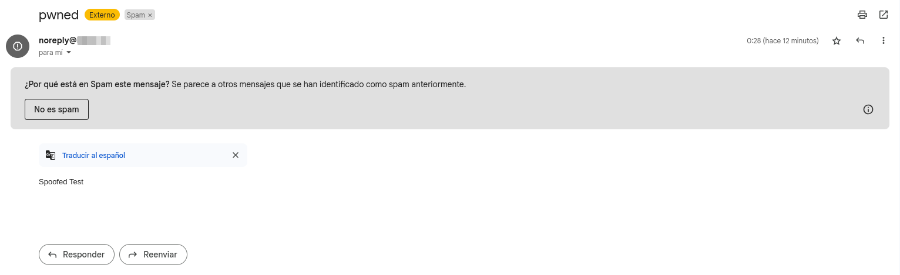

# checkDomain 📧

checkDomain is a lightweight and straightforward CLI utility for quickly analyzing a domain's email security posture (SPF & DMARC) and testing spoofed email delivery.

Designed for security researchers, red teamers, and pentesters, checkDomain helps assess how susceptible an organization is to basic spoofing attacks by checking their DNS protections and simulating an email from a forged sender (e.g., `noreply@target.com`).

## Overview

checkDomain allows you to:

- Retrieve and display SPF records
- Retrieve and display DMARC records
- Send a spoofed test email using the target domain
- Evaluate the ease of email spoofing against a domain

All DNS lookups are performed via the `dnspython` module to ensure compatibility and performance across platforms, eliminating dependency on external binaries like `dig`.


## Requirements

- Python 3.x
- [swaks](https://github.com/jetmore/swaks) (for spoofed email sending)
- Python dependencies:

```bash
pip install dnspython
```

## 🚀 Usage

```bash
$ python3 domain_tool.py -h

usage: domain_tool.py [-h] [-d DOMAIN] [-s RECIPIENT]

Domain analysis and spoofed email sender

options:
  -h, --help            show this help message and exit
  -d DOMAIN, --domain DOMAIN
                        Target domain for SPF and DMARC analysis
  -s RECIPIENT, --send RECIPIENT
                        Recipient email address for spoofed test (sender is noreply@domain)
```

## Example Scenarios

### 1. Analyze a domain's email protection records

```bash
python3 domain_tool.py -d example.com
```

Expected output:

```
[+] SPF: v=spf1 include:example.net include:spf.protection.outlook.com ~all
[+] DMARC: v=DMARC1; p=none; rua=mailto:dmarc@example.com
```

### 2. Send a spoofed test email

```bash
python3 domain_tool.py -d example.com -s you@yourmail.com
```

This sends an email from `noreply@example.com` to `you@yourmail.com` using `swaks`. Useful for testing whether your spoofed message is delivered, quarantined, or blocked.



## Disclaimer

This tool is intended strictly for **authorized security testing and research purposes only**.

**Do not use checkDomain against domains or targets without explicit permission. Misuse may be illegal and unethical.**
